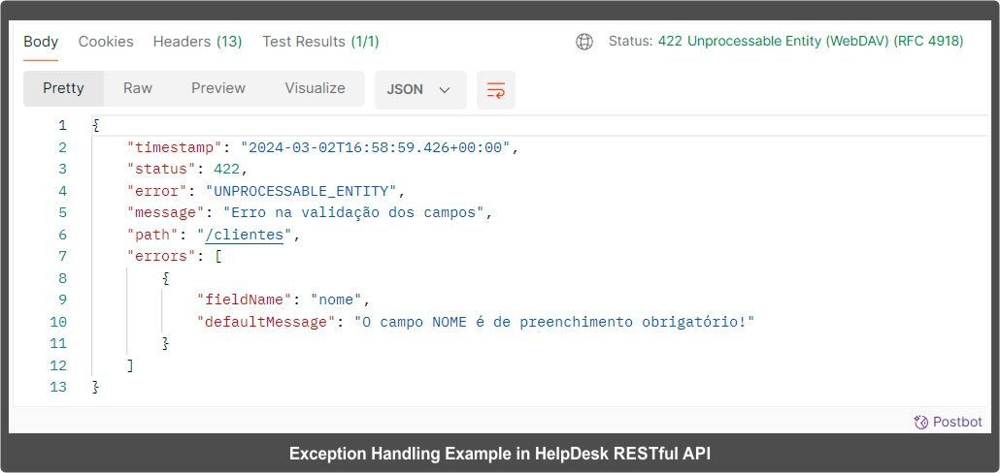

# HelpDesk RESTful API

## Escolha seu Idioma   Choose Your Language 

- [Português (Brasil)](#versão-em-português)
- [English (United States)](#english-version)

 

##  Versão em Português

### HelpDesk RESTful API - Resumo
A **HelpDesk RESTful API** é um projeto de **transformação** criado para consolidar os conhecimentos adquiridos em **Spring Framework**. A API consiste no **backend** de uma aplicação de **gerenciamento de chamados**. O projeto utiliza **Spring Boot, Spring Web, Spring Data, Spring Validation, Spring Security, Spring Test, JWT e Servidor de Recursos Oauth 2**. A aplicação segue as melhores práticas de desenvolvimento de APIs **RESTful**, retornando sempre **códigos de status HTTP apropriados** para cada tipo de operação.

A aplicação possui controle de **autenticação** e **autorização**, tendo, portanto, áreas que só podem ser acessadas por usuários autenticados de determinado perfil. Todo usuário ao ser cadastrado recebe um perfil, podendo este variar entre **cliente, técnico ou administrador**:

  * Usuários com **perfil cliente** podem efetuar seu cadastro no sistema e **consultar** informações sobre **chamados**.
  * Usuários com **perfil técnico** podem cadastrar novos **chamados**.
  * Usuários com **perfil administrador** podem cadastrar novos **técnicos**.

Além dos **perfis de usuário** a aplicação possui dois **perfis de inicialização**. No perfil **test** a aplicação utiliza um banco de dados **H2**. No perfil **dev** um banco de dados **MySQL**. É possível alterar facilmente o perfil de inicialização da aplicação modificando apenas a propriedade **spring.profiles.active** — do arquivo de configuração **application.properties**.

O projeto possui **testes de unidade** detalhados, além de uma **carga inicial de dados de teste** que permitem facilmente testar no **Postman**, assim que a aplicação é inicializada.

Para maiores informações, visite a página oficial do projeto:  
<https://togtec.com.br/projetos/helpdesk-restful-api/resumo.php>

### Tecnologias
  * Java SE (17)
  * Spring Boot 3
  * Maven
  * JPA + Hibernate 
  * H2 (no perfil de inicialização **test**)
  * MySQL (no perfil de inicialização **dev**)
  * JUnit 5 + Mockito (testes)
  
### IDE  
  * Visual Studio Code

### Diagrama de Cenário de Teste

  

Ver galeria completa de imagens em:  
<https://togtec.com.br/projetos/helpdesk-restful-api/imagens.php>

### Tratamento de Exceção
A HelpDesk RESTful API é uma joia do tratamento de exceção, que em caso de erro informa o **código de retorno, o tipo do erro, a descrição do erro e os atributos preenchidos de forma inválida**:

  

### Funcionalidades
- Cliente
    - Efetua cadastro no sistema.
    - Efetua login.
    - Consulta Cliente.
    - Atualiza Cliente.
    - Exclui Cliente.
    - Consulta Chamado.    
- Técnico
    - Efetua login.
    - Consulta Técnico.
    - Consulta lista de Clientes.
    - Cria Chamado.
    - Consulta lista de Chamados.
    - Atualiza Chamado.
- Administrador
    - Efetua login.
    - Cadastra Técnico.
    - Atualiza Técnico.
    - Exclui Técnico.

### Executando o código localmente
(você precisa ter o Java e o Maven instalados e configurados localmente)  
Abra a **HelpDesk RESTful API** em sua IDE favorita como um **Maven Project** e execute o projeto como **Spring Boot Application**.

 

##  English Version

### HelpDesk RESTful API - Overview
The **HelpDesk RESTful API** is a **transformation project** designed to consolidate knowledge acquired in the **Spring Framework**. The API serves as the **backend for a ticket management application**. The project utilizes **Spring Boot**, **Spring Web**, **Spring Data**, **Spring Validation**, **Spring Security**, **Spring Test**, **JWT**, and **Oauth 2 Resource Server**. The application follows best practices for developing RESTful APIs, consistently returning **appropriate HTTP status codes** for each type of operation.

The application features **authentication** and **authorization** control, with certain areas accessible only to authenticated users of specific roles. Upon registration, each user is assigned a role, which can be **client**, **technician**, or **administrator**:

* Users with the **client role** can register in the system and **view ticket information**.
* Users with the **technician role** can **create new tickets**.
* Users with the **administrator role** can **register new technicians**.

In addition to **user roles**, the application has two **startup profiles**. In the **test profile**, the application uses an **H2** database; in the **dev** profile, it uses a **MySQL** database. You can easily switch the startup profile by modifying the **spring.profiles.active** property in the **application.properties** configuration file.

The project includes detailed **unit tests**, along with an **initial test data load** that allows quick testing through **Postman** as soon as the application is up and running.

For more information, visit the project's official page:  
<https://en.togtec.com.br/projects/helpdesk-restful-api/summary.php>

### Technologies
  * Java SE (17)
  * Spring Boot 3
  * Maven
  * JPA + Hibernate
  * H2 (in the test startup profile)
  * MySQL (in the dev startup profile)
  * JUnit 5 + Mockito (testing)
    
### IDE
  * Visual Studio Code

### Test Scenario Diagram

  

See the full image gallery at:  
<https://en.togtec.com.br/projects/helpdesk-restful-api/images.php>

### Exception Handling
The HelpDesk RESTful API excels in exception handling, providing **return code**, **error type**, **error description**, and **invalid attributes** when an error occurs:

  

### Features
  * Client
    - Registers in the system.
    - Logs in.
    - Views Client information.
    - Updates Client information.
    - Deletes Client.
    - Views Ticket.
  * Technician
    - Logs in.
    - Views Technician information.
    - Views Client list.
    - Creates Ticket.
    - Views Ticket list.
    - Updates Ticket.
  * Administrator
    - Logs in.
    - Adds Technician.
    - Updates Technician.
    - Deletes Technician.

### Running the Code Locally
(you need to have Java and Maven installed and configured locally)   
Open the **HelpDesk RESTful API** in your favorite IDE as a **Maven Project**, and run it as a **Spring Boot Application**.
